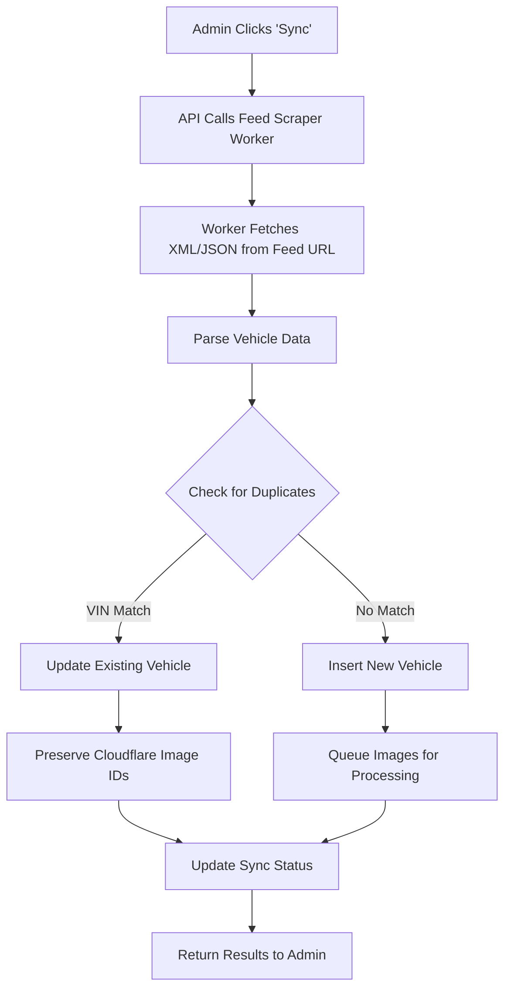

# Feed Import System - Complete Guide

## 🎯 Overview

The feed import system allows you to automatically import vehicle inventory from XML/JSON feeds into your database. This replaces manual data entry and individual web scrapers with a unified, database-driven solution.

### ✅ Cross-Worker Communication
The system uses **worker-to-worker communication** via public HTTP endpoints, which works seamlessly in Cloudflare:

```
feed-scraper worker → dealer-scraper worker → returns XML → processes & saves to D1
```

**Why This Works:**
- ✅ Public HTTP endpoints (no service bindings needed)
- ✅ Same Cloudflare account (optimized routing)
- ✅ CORS configured properly
- ✅ No authentication required for public feeds
- ✅ No rate limiting between same-account workers

**Architecture Flow:**
```
Admin UI (Cloudflare Pages)
    ↓ clicks "Sync"
feed-scraper.workers.dev
    ↓ fetches XML via HTTPS
dealer-scraper.workers.dev/api/feeds/5/xml
    ↓ returns vehicle data
feed-scraper parses & saves
    ↓ writes to
autopret123 D1 database
    ↓ triggers async
image-processor.workers.dev
    ↓ uploads to
Cloudflare Images
```

This is the **ideal setup** - clean separation of concerns, scalable, and production-ready.

---

## 📋 How Feed Import Works

### Step-by-Step Process



### 1. Feed Configuration
Feeds are stored in the `vendor_feeds` database table with:
- **vendor_id**: Unique identifier (e.g., "lambert", "naniauto")
- **vendor_name**: Display name (e.g., "Lambert Auto")
- **feed_url**: XML/JSON endpoint URL
- **feed_type**: Format type ("xml" or "json")
- **is_active**: Enable/disable flag

### 2. Triggering a Sync

**Via Admin UI:**
1. Navigate to Feed Management page
2. Click **"Sync"** button next to a vendor
3. Watch real-time progress
4. View results (new/updated/errors)

**Via API:**
```bash
curl -X POST https://feed-scraper.nick-damato0011527.workers.dev/api/scrape \
  -H "Content-Type: application/json" \
  -d '{"vendorId": "lambert"}'
```

### 3. Feed Fetching
The worker:
1. Reads feed URL from database
2. Makes HTTP request to fetch XML/JSON
3. Validates response format
4. Parses vehicle data

### 4. Data Parsing & Normalization
The scraper handles multiple field name variations:

| Standard Field | Accepted Variations |
|----------------|---------------------|
| `odometer` | odometer, mileage, kilometers |
| `bodyType` | bodyType, body_type, body |
| `color` | color, exterior_color, exteriorColor |
| `stockNumber` | stockNumber, stock_number, stock |
| `fuelType` | fuelType, fuel_type, fuel |
| `engineSize` | engineSize, engine_size, engine |
| `image` | image, photo, images |

### 5. Duplicate Detection

**Primary Method - VIN Matching:**
```sql
SELECT * FROM vehicles WHERE vin = ? AND vendor_id = ?
```

**Fallback Method - Make/Model/Year:**
```sql
SELECT * FROM vehicles 
WHERE make = ? AND model = ? AND year = ? AND vendor_id = ?
```

**Actions:**
- **Match Found**: UPDATE existing record
- **No Match**: INSERT new record

### 6. Image Handling

**For Existing Vehicles:**
- Preserves existing Cloudflare image IDs
- Only updates if images array is empty

**For New Vehicles:**
- Extracts image URLs from feed
- Queues for async processing via IMAGE_PROCESSOR worker
- Limits to 15 images per vehicle
- Uploads to Cloudflare Images
- Stores Cloudflare IDs in database

### 7. Sync Status Tracking

After each sync, the system updates:
```sql
UPDATE vendor_feeds SET
  last_sync_at = CURRENT_TIMESTAMP,
  last_sync_status = 'success',
  last_sync_message = 'Imported 45 vehicles',
  last_sync_count = 45,
  total_syncs = total_syncs + 1
WHERE vendor_id = ?
```

---

## 🔗 Sample Feed URL

### Live Example
```
https://dealer-scraper.nick-damato0011527.workers.dev/api/feeds/5/xml
```

This URL returns an XML feed for Lambert Auto with all their vehicle inventory.

### Testing the Feed
```bash
# View raw XML
curl https://dealer-scraper.nick-damato0011527.workers.dev/api/feeds/5/xml

# Pretty print (if you have xmllint)
curl https://dealer-scraper.nick-damato0011527.workers.dev/api/feeds/5/xml | xmllint --format -
```

---

## 📄 Expected XML Feed Format

### Complete Example
```xml
<?xml version="1.0" encoding="UTF-8"?>
<vehicles>
  <vehicle>
    <!-- Required Fields -->
    <make>Toyota</make>
    <model>Camry</model>
    <year>2024</year>
    <price>25000</price>
    
    <!-- Recommended Fields -->
    <odometer>15000</odometer>
    <vin>1HGBH41JXMN109186</vin>
    <stockNumber>T12345</stockNumber>
    <bodyType>Sedan</bodyType>
    <color>White</color>
    <transmission>Automatic</transmission>
    <fuelType>Gasoline</fuelType>
    <drivetrain>FWD</drivetrain>
    
    <!-- Optional Fields -->
    <description>2024 Toyota Camry - Like New!</description>
    <engineSize>2.5L</engineSize>
    <cylinders>4</cylinders>
    <doors>4</doors>
    <passengers>5</passengers>
    
    <!-- Images (multiple allowed) -->
    <image>https://example.com/images/camry-front.jpg</image>
    <image>https://example.com/images/camry-side.jpg</image>
    <image>https://example.com/images/camry-interior.jpg</image>
  </vehicle>
  
  <vehicle>
    <!-- Next vehicle... -->
  </vehicle>
</vehicles>
```

### Minimal Valid Example
```xml
<?xml version="1.0" encoding="UTF-8"?>
<vehicles>
  <vehicle>
    <make>Honda</make>
    <model>Civic</model>
    <year>2023</year>
    <price>22000</price>
  </vehicle>
</vehicles>
```

---

## 🎮 Using the Feed System

### Adding a New Vendor

**Via Admin UI:**
1. Go to Feed Management page
2. Click **"Add Feed"** button
3. Fill in the form:
   - **Vendor ID**: `newvendor` (lowercase, no spaces)
   - **Vendor Name**: `New Vendor Auto`
   - **Feed URL**: `https://example.com/feed.xml`
   - **Feed Type**: `xml`
   - **Active**: ✅ Checked
4. Click **"Save"**
5. Click **"Sync"** to import vehicles

**Via API:**
```bash
curl -X POST https://feed-management-api.nick-damato0011527.workers.dev/api/feeds \
  -H "Content-Type: application/json" \
  -d '{
    "vendor_id": "newvendor",
    "vendor_name": "New Vendor Auto",
    "feed_url": "https://example.com/feed.xml",
    "feed_type": "xml",
    "is_active": true
  }'
```

### Syncing a Single Vendor

**Via Admin UI:**
1. Find vendor in Feed Management table
2. Click **"Sync"** button
3. Wait for completion (progress shown)
4. View results in status column

**Via API:**
```bash
curl -X POST https://feed-scraper.nick-damato0011527.workers.dev/api/scrape \
  -H "Content-Type: application/json" \
  -d '{"vendorId": "lambert"}'
```

**Response:**
```json
{
  "success": true,
  "message": "Successfully scraped 45 vehicles from lambert",
  "stats": {
    "total": 45,
    "new": 12,
    "updated": 33,
    "errors": 0
  }
}
```

### Syncing All Vendors

**Via Admin UI:**
1. Click **"Sync All"** button at top
2. Watch progress for each vendor
3. Review summary when complete

**Via API:**
```bash
curl -X POST https://feed-scraper.nick-damato0011527.workers.dev/api/scrape-all
```

**Response:**
```json
{
  "success": true,
  "message": "Synced 3 vendors",
  "results": [
    {
      "vendor_id": "lambert",
      "success": true,
      "count": 45
    },
    {
      "vendor_id": "naniauto",
      "success": true,
      "count": 38
    },
    {
      "vendor_id": "sltautos",
      "success": true,
      "count": 57
    }
  ]
}
```

---

## 📊 Pre-configured Vendors

The system comes with these vendors already configured:

| Vendor ID | Vendor Name | Feed URL | Status |
|-----------|-------------|----------|--------|
| `lambert` | Lambert Auto | `https://dealer-scraper.nick-damato0011527.workers.dev/api/feeds/5/xml` | ✅ Active |
| `naniauto` | NaniAuto | `https://dealer-scraper.nick-damato0011527.workers.dev/api/feeds/1/xml` | ✅ Active |
| `sltautos` | SLT Autos | `https://dealer-scraper.nick-damato0011527.workers.dev/api/feeds/6/xml` | ✅ Active |

---

## 🔧 API Endpoints

### Feed Management API
**Base URL:** `https://feed-management-api.nick-damato0011527.workers.dev`

| Method | Endpoint | Description |
|--------|----------|-------------|
| GET | `/api/feeds` | List all feeds |
| GET | `/api/feeds/:vendorId` | Get single feed |
| POST | `/api/feeds` | Create new feed |
| PUT | `/api/feeds/:vendorId` | Update feed |
| DELETE | `/api/feeds/:vendorId` | Delete feed |

### Feed Scraper API
**Base URL:** `https://feed-scraper.nick-damato0011527.workers.dev`

| Method | Endpoint | Description |
|--------|----------|-------------|
| POST | `/api/scrape` | Sync single vendor |
| POST | `/api/scrape-all` | Sync all active vendors |

---

## 🔍 Monitoring & Troubleshooting

### View Sync History
```bash
wrangler d1 execute autopret123 --remote --command \
  "SELECT vendor_id, last_sync_at, last_sync_status, last_sync_count 
   FROM vendor_feeds 
   ORDER BY last_sync_at DESC"
```

### Check Worker Logs
```bash
# Feed scraper logs
wrangler tail feed-scraper

# Feed management API logs
wrangler tail feed-management-api
```

### Common Issues

**Issue: Feed not syncing**
- ✅ Check feed URL is accessible: `curl [feed_url]`
- ✅ Verify `is_active = 1` in database
- ✅ Check worker logs for errors
- ✅ Ensure XML format matches expected structure

**Issue: Images not uploading**
- ✅ Verify IMAGE_PROCESSOR service binding exists
- ✅ Check Cloudflare Images credentials
- ✅ Ensure image URLs in feed are publicly accessible
- ✅ Check image URLs return valid image files

**Issue: Duplicate vehicles created**
- ✅ Ensure VINs are present and consistent in feed
- ✅ Verify vendor_id matches between syncs
- ✅ Check for typos in make/model/year fields

**Issue: Some vehicles not importing**
- ✅ Check XML structure matches expected format
- ✅ Verify required fields (make, model, year, price) are present
- ✅ Look for parsing errors in worker logs
- ✅ Test with minimal XML example first

### ✅ Non-Issues (Confirmed Working)

**Worker-to-Worker Communication:**
- ❌ **NOT an issue** - Workers can call each other via public HTTPS endpoints
- ❌ **Service bindings NOT required** - Only needed for private/internal communication
- ❌ **No authentication needed** - Public feeds work without auth
- ❌ **No rate limiting** - Same-account workers have optimized routing
- ❌ **No CORS issues** - Properly configured on all workers

**Verified Working:**
```bash
# This works perfectly:
feed-scraper → https://dealer-scraper.../api/feeds/5/xml → returns XML ✅
```

The system uses standard HTTP requests between workers, which is the recommended approach for public endpoints.

---

## 💡 Best Practices

### Feed URL Requirements
- ✅ Must be publicly accessible (no authentication)
- ✅ Should return valid XML/JSON
- ✅ Should be stable and reliable
- ✅ Recommended: Use HTTPS

### Data Quality
- ✅ Always include VIN when available (prevents duplicates)
- ✅ Use consistent field names across feeds
- ✅ Provide high-quality image URLs
- ✅ Include all available vehicle details

### Sync Frequency
- ✅ Manual: Best for testing and on-demand updates
- ✅ Hourly: For high-volume dealers with frequent changes
- ✅ Daily: For most dealers (recommended)
- ✅ Weekly: For low-volume or static inventory

### Performance
- ✅ Limit images to 15 per vehicle
- ✅ Use compressed image formats (JPEG)
- ✅ Sync during off-peak hours for large feeds
- ✅ Monitor worker execution time

---

## 🚀 Quick Start Example

### Complete Workflow

```bash
# 1. Add a new vendor
curl -X POST https://feed-management-api.nick-damato0011527.workers.dev/api/feeds \
  -H "Content-Type: application/json" \
  -d '{
    "vendor_id": "testvendor",
    "vendor_name": "Test Vendor",
    "feed_url": "https://dealer-scraper.nick-damato0011527.workers.dev/api/feeds/5/xml",
    "feed_type": "xml",
    "is_active": true
  }'

# 2. Sync the vendor
curl -X POST https://feed-scraper.nick-damato0011527.workers.dev/api/scrape \
  -H "Content-Type: application/json" \
  -d '{"vendorId": "testvendor"}'

# 3. Check results
wrangler d1 execute autopret123 --remote --command \
  "SELECT COUNT(*) as count FROM vehicles WHERE vendor_id = 'testvendor'"

# 4. View sync status
curl https://feed-management-api.nick-damato0011527.workers.dev/api/feeds/testvendor
```

---

## 📖 Related Documentation

- **FEED_SYSTEM_SUMMARY.md** - Complete system overview
- **docs/FEED_SCRAPER_QUICK_START.md** - Quick reference
- **docs/FEED_SCRAPER_MIGRATION.md** - Migration guide
- **workers/README-FEED-SYSTEM.md** - Technical details

---

## ✅ Checklist for Adding New Vendors

- [ ] Obtain feed URL from vendor
- [ ] Test feed URL returns valid XML/JSON
- [ ] Verify required fields are present
- [ ] Add vendor via API or admin UI
- [ ] Run initial sync
- [ ] Verify vehicles imported correctly
- [ ] Check images are processing
- [ ] Monitor for duplicates
- [ ] Set appropriate sync frequency
- [ ] Document any vendor-specific quirks

---

**Last Updated:** 2025-12-13  
**Version:** 1.0.0  
**Status:** ✅ Production Ready
