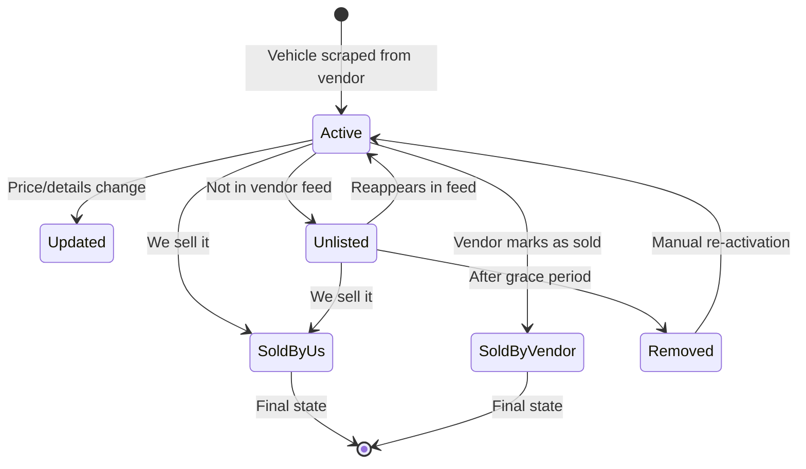

# Multi-Vendor Inventory Management System Design

## Overview
This document outlines the implementation of a multi-vendor inventory management system that tracks vehicles from different sources and handles their lifecycle appropriately.

## Database Schema Changes

### 1. Vehicles Table Updates
```sql
-- Add vendor tracking fields to vehicles table
ALTER TABLE vehicles ADD COLUMN vendor_id VARCHAR(50);
ALTER TABLE vehicles ADD COLUMN vendor_name VARCHAR(100);
ALTER TABLE vehicles ADD COLUMN vendor_stock_number VARCHAR(100);
ALTER TABLE vehicles ADD COLUMN last_seen_from_vendor TIMESTAMP;
ALTER TABLE vehicles ADD COLUMN vendor_status VARCHAR(50) DEFAULT 'active'; 
-- Values: 'active', 'unlisted', 'sold_by_us', 'sold_by_vendor', 'removed'
ALTER TABLE vehicles ADD COLUMN sync_status VARCHAR(50) DEFAULT 'synced';
-- Values: 'synced', 'pending_removal', 'manually_kept'

-- Create index for vendor queries
CREATE INDEX idx_vendor_tracking ON vehicles(vendor_id, vendor_status, last_seen_from_vendor);
```

### 2. Vendors Table (New)
```sql
CREATE TABLE vendors (
  id INTEGER PRIMARY KEY AUTOINCREMENT,
  vendor_id VARCHAR(50) UNIQUE NOT NULL,
  vendor_name VARCHAR(100) NOT NULL,
  vendor_type VARCHAR(50), -- 'scraper', 'api', 'manual'
  api_endpoint TEXT,
  scraper_url TEXT,
  sync_frequency VARCHAR(50), -- 'hourly', 'daily', 'weekly'
  last_sync TIMESTAMP,
  is_active BOOLEAN DEFAULT true,
  settings JSON, -- Vendor-specific settings
  created_at TIMESTAMP DEFAULT CURRENT_TIMESTAMP,
  updated_at TIMESTAMP DEFAULT CURRENT_TIMESTAMP
);

-- Insert Lambert as first vendor
INSERT INTO vendors (vendor_id, vendor_name, vendor_type, scraper_url, sync_frequency)
VALUES ('lambert', 'Lambert Auto', 'scraper', 'https://automobile-lambert.com', 'daily');
```

### 3. Vendor Sync Log Table (New)
```sql
CREATE TABLE vendor_sync_logs (
  id INTEGER PRIMARY KEY AUTOINCREMENT,
  vendor_id VARCHAR(50),
  sync_date TIMESTAMP DEFAULT CURRENT_TIMESTAMP,
  vehicles_found INTEGER,
  new_vehicles INTEGER,
  updated_vehicles INTEGER,
  removed_vehicles INTEGER,
  status VARCHAR(50), -- 'success', 'partial', 'failed'
  error_message TEXT,
  sync_duration_seconds INTEGER
);
```

## Vehicle Lifecycle Management

### States and Transitions



## Implementation Components

### 1. Vendor Manager Component
```typescript
interface Vendor {
  vendor_id: string;
  vendor_name: string;
  vendor_type: 'scraper' | 'api' | 'manual';
  last_sync?: string;
  is_active: boolean;
  stats?: {
    total_vehicles: number;
    active_vehicles: number;
    sold_vehicles: number;
  };
}

interface VehicleWithVendor extends Vehicle {
  vendor_id: string;
  vendor_name: string;
  vendor_status: 'active' | 'unlisted' | 'sold_by_us' | 'sold_by_vendor' | 'removed';
  last_seen_from_vendor: string;
  sync_status: 'synced' | 'pending_removal' | 'manually_kept';
}
```

### 2. Sync Logic

#### When Scraping/Syncing:
```typescript
async function syncVendorInventory(vendorId: string) {
  // 1. Get current vendor vehicles from source
  const vendorVehicles = await scrapeVendorInventory(vendorId);
  
  // 2. Get our existing vehicles from this vendor
  const existingVehicles = await getVehiclesByVendor(vendorId);
  
  // 3. Process each vehicle from vendor
  for (const vendorVehicle of vendorVehicles) {
    const existing = findExistingVehicle(vendorVehicle, existingVehicles);
    
    if (existing) {
      // Update vehicle and mark as seen
      await updateVehicle({
        ...vendorVehicle,
        last_seen_from_vendor: new Date(),
        vendor_status: 'active',
        sync_status: 'synced'
      });
    } else {
      // Add new vehicle
      await addVehicle({
        ...vendorVehicle,
        vendor_id: vendorId,
        vendor_status: 'active',
        sync_status: 'synced',
        last_seen_from_vendor: new Date()
      });
    }
  }
  
  // 4. Handle vehicles not in current sync
  const vehiclesNotInSync = existingVehicles.filter(
    ev => !vendorVehicles.find(vv => matchesVehicle(vv, ev))
  );
  
  for (const missingVehicle of vehiclesNotInSync) {
    await handleMissingVehicle(missingVehicle);
  }
}

async function handleMissingVehicle(vehicle: VehicleWithVendor) {
  // If sold by us, keep it
  if (vehicle.isSold === 1 || vehicle.vendor_status === 'sold_by_us') {
    return; // Keep in inventory
  }
  
  // Calculate days since last seen
  const daysSinceLastSeen = getDaysSince(vehicle.last_seen_from_vendor);
  
  if (daysSinceLastSeen < 3) {
    // Grace period - mark as unlisted but keep visible
    await updateVehicle({
      id: vehicle.id,
      vendor_status: 'unlisted',
      sync_status: 'pending_removal'
    });
  } else if (daysSinceLastSeen >= 3 && daysSinceLastSeen < 7) {
    // Hide from public but keep in admin
    await updateVehicle({
      id: vehicle.id,
      vendor_status: 'unlisted',
      isPublished: false
    });
  } else {
    // After 7 days, mark as removed
    await updateVehicle({
      id: vehicle.id,
      vendor_status: 'removed',
      isPublished: false
    });
  }
}
```

## Dashboard UI Components

### 1. Vendor Filter/View
```typescript
// Add to vehicles list page
<div className="flex space-x-4 mb-4">
  <select 
    value={selectedVendor} 
    onChange={(e) => setSelectedVendor(e.target.value)}
    className="px-4 py-2 border rounded-lg"
  >
    <option value="all">All Vendors</option>
    <option value="lambert">Lambert Auto</option>
    <option value="dealer2">Dealer 2</option>
    <option value="internal">Internal Inventory</option>
  </select>
  
  <div className="flex items-center space-x-2">
    <span className="text-sm text-gray-600">Status:</span>
    <label className="flex items-center">
      <input type="checkbox" checked={showActive} onChange={(e) => setShowActive(e.target.checked)} />
      <span className="ml-1">Active</span>
    </label>
    <label className="flex items-center">
      <input type="checkbox" checked={showUnlisted} onChange={(e) => setShowUnlisted(e.target.checked)} />
      <span className="ml-1">Unlisted</span>
    </label>
  </div>
</div>
```

### 2. Vehicle Card Vendor Badge
```typescript
// Add vendor badge to vehicle cards
<div className="absolute top-2 right-2 flex space-x-2">
  <span className="px-2 py-1 bg-blue-100 text-blue-800 text-xs rounded-full">
    {vehicle.vendor_name}
  </span>
  {vehicle.vendor_status === 'unlisted' && (
    <span className="px-2 py-1 bg-yellow-100 text-yellow-800 text-xs rounded-full">
      Unlisted
    </span>
  )}
  {vehicle.sync_status === 'pending_removal' && (
    <span className="px-2 py-1 bg-orange-100 text-orange-800 text-xs rounded-full">
      Pending Removal
    </span>
  )}
</div>
```

### 3. Vendor Management Page
```typescript
// New admin page for vendor management
export default function VendorManagement() {
  return (
    <div className="p-6">
      <h1 className="text-2xl font-bold mb-6">Vendor Management</h1>
      
      {/* Vendor Stats Grid */}
      <div className="grid grid-cols-1 md:grid-cols-3 gap-6 mb-8">
        {vendors.map(vendor => (
          <div key={vendor.vendor_id} className="bg-white rounded-lg shadow p-6">
            <h3 className="font-semibold text-lg mb-2">{vendor.vendor_name}</h3>
            <div className="space-y-2 text-sm">
              <div className="flex justify-between">
                <span>Total Vehicles:</span>
                <span className="font-semibold">{vendor.stats.total_vehicles}</span>
              </div>
              <div className="flex justify-between">
                <span>Active:</span>
                <span className="text-green-600">{vendor.stats.active_vehicles}</span>
              </div>
              <div className="flex justify-between">
                <span>Unlisted:</span>
                <span className="text-yellow-600">{vendor.stats.unlisted_vehicles}</span>
              </div>
              <div className="flex justify-between">
                <span>Last Sync:</span>
                <span>{formatDate(vendor.last_sync)}</span>
              </div>
            </div>
            <button className="mt-4 w-full bg-blue-500 text-white py-2 rounded hover:bg-blue-600">
              Sync Now
            </button>
          </div>
        ))}
      </div>
      
      {/* Sync History */}
      <div className="bg-white rounded-lg shadow p-6">
        <h2 className="text-xl font-semibold mb-4">Sync History</h2>
        <table className="w-full">
          <thead>
            <tr className="border-b">
              <th className="text-left py-2">Vendor</th>
              <th className="text-left py-2">Date</th>
              <th className="text-left py-2">Found</th>
              <th className="text-left py-2">New</th>
              <th className="text-left py-2">Updated</th>
              <th className="text-left py-2">Removed</th>
              <th className="text-left py-2">Status</th>
            </tr>
          </thead>
          <tbody>
            {syncLogs.map(log => (
              <tr key={log.id} className="border-b">
                <td className="py-2">{log.vendor_name}</td>
                <td className="py-2">{formatDate(log.sync_date)}</td>
                <td className="py-2">{log.vehicles_found}</td>
                <td className="py-2 text-green-600">+{log.new_vehicles}</td>
                <td className="py-2 text-blue-600">↻{log.updated_vehicles}</td>
                <td className="py-2 text-red-600">-{log.removed_vehicles}</td>
                <td className="py-2">
                  <span className={`px-2 py-1 rounded text-xs ${
                    log.status === 'success' ? 'bg-green-100 text-green-800' :
                    log.status === 'partial' ? 'bg-yellow-100 text-yellow-800' :
                    'bg-red-100 text-red-800'
                  }`}>
                    {log.status}
                  </span>
                </td>
              </tr>
            ))}
          </tbody>
        </table>
      </div>
    </div>
  );
}
```

## Configuration Options

### Vendor-Specific Rules
```typescript
interface VendorRules {
  vendor_id: string;
  auto_remove_after_days: number; // Days before removing unlisted vehicles
  grace_period_days: number; // Days to wait before marking as unlisted
  auto_publish: boolean; // Automatically publish new vehicles
  price_markup_percentage?: number; // Optional markup on vendor prices
  excluded_makes?: string[]; // Makes to exclude from import
  minimum_price?: number; // Don't import vehicles below this price
  maximum_age_years?: number; // Don't import vehicles older than X years
}
```

## Benefits of This System

1. **Multi-Vendor Support**: Track vehicles from multiple sources
2. **Automated Lifecycle**: Handles vehicles disappearing from feeds intelligently
3. **Grace Periods**: Doesn't immediately remove vehicles (could be temporary)
4. **Sold Vehicle Protection**: Vehicles you've sold stay in inventory
5. **Vendor Analytics**: Track performance of each vendor
6. **Flexible Rules**: Different rules per vendor
7. **Audit Trail**: Complete history of sync operations

## Next Steps

1. Implement database schema changes
2. Update Lambert scraper to use new vendor fields
3. Create vendor management UI
4. Add sync scheduling system
5. Implement notification system for major changes
6. Add vendor-specific pricing rules
